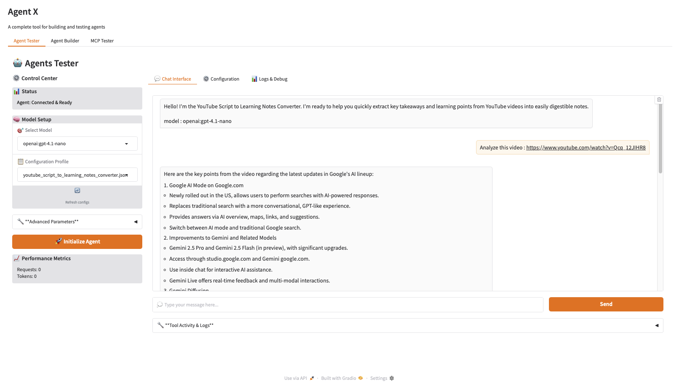

# 🤖 Agent X - Complete AI Agent Development Platform

[](https://python.org)
[](https://gradio.app)
[](https://modelcontextprotocol.io)
[](LICENSE)

> **Agent X** is a comprehensive, user-friendly platform for building, testing, and managing AI agents with Model Context Protocol (MCP) integration. Create powerful AI agents with custom tools, test them in real-time, and manage MCP servers - all through an intuitive web interface. The agents are build on top of the Google Agent Development Kit (Google ADK)


## ☕ Support

If you find this project helpful, consider buying me a coffee — it keeps me going and helps support future development!

[](https://buymeacoffee.com/agentx)


## 🌟 Key Features

### 🏗️ **Agent Builder**

- **Visual Agent Creation**: Build AI agents through an intuitive interface
- **Smart Prompt Engineering**: AI-powered prompt optimization and structuring
- **Multi-Model Support**: Compatible with OpenAI GPT, Google Gemini, and LM Studio models
- **MCP Tool Integration**: Seamlessly integrate external tools via Model Context Protocol


- **MCP tool builder**:Integrated functionality to build and test your own MCP tools.
- **Real-time Configuration**: Live preview and testing during agent development
- **Export & Import**: Save and share agent configurations as JSON

### 🧪 **Agent Tester**

- **Interactive Testing Environment**: Chat with your agents in real-time
- **Performance Monitoring**: Track token usage, response times, and execution logs

- **Multi-Agent Management**: Load and test different agent configurations
- **Debug & Analytics**: Comprehensive logging and error tracking
- **Tool Execution Tracking**: Monitor MCP tool calls and results
- **Configuration Hot-Swapping**: Switch between agent configs without restart

### 🛠️ **MCP Tools Manager**

- **Server Auto-Discovery**: Automatically detect and load MCP servers
- **Interactive Tool Testing**: Test MCP tools with dynamic form generation
- **Multi-Server Support**: Manage multiple MCP servers simultaneously
- **Real-time Execution**: Execute tools with live feedback and results
- **Schema Validation**: Automatic parameter validation and type conversion
- **Beautiful UI**: Modern, responsive interface with gradient animations

## 🚀 Quick Start

### Prerequisites
- Python 3.8 or higher
- Node.js (for MCP servers)
- API keys for your preferred AI models

### Installation

1. **Clone the repository**
```bash
git clone https://github.com/noaman/agentX.git
cd agentX
```

2. **Install dependencies**
```bash
pip install -r requirements.txt
```

3. **Configure API Keys**

#### Important : Rename constants.example.py to constants.py
Edit `constants.py` with your API keys:
```python
GEMINI_API_KEY = "your-gemini-api-key"
OPENAI_API_KEY = "your-openai-api-key"
```

I have used LMStudio for local models, but you can use Ollama and others too.
Just ensure that when you use tool calling, you choose the right models that support it.

4. **Set up MCP Servers** (Optional)

#### Important : Rename mcp_config_example.json to mcp_config.json

Configure your MCP servers in `mcp/mcp_config.json`:
```json
{
  "mcpServers": {
    "brave-search": {
      "command": "npx",
      "args": ["-y", "@modelcontextprotocol/server-brave-search"],
      "env": {
        "BRAVE_API_KEY": "your-brave-api-key"
      }
    }
  }
}
```

5. **Launch Agent X**
```bash
python home.py
```

Navigate to `http://localhost:{port}` in your browser. The URL will be shown in the terminal.


6. **MCP tool builing**
- Two tools are integrated for demo : youtube script analyzer and a sample tool
- You can add more tools in mcp/tools folder as per the sample provided
- You can define the tool in server.py in /mcp/server.py and it will start listing in the agent builder interface.


## ☕ Support

If you find this project helpful, consider buying me a coffee — it keeps me going and helps support future development!

[](https://buymeacoffee.com/agentx)


## 📖 Usage Guide

### 🏗️ Building Your First Agent

1. **Open Agent Builder Tab**
   - Select your preferred AI model (GPT-4, Gemini, etc.)
   - Click "Initialize Agent" to start

2. **Describe Your Agent**
   ```
   Create a social media content creator that generates engaging posts 
   for different platforms with hashtag suggestions and optimal timing.
   ```

3. **AI-Powered Generation**
   - The system uses advanced prompt engineering to create your agent
   - Generates optimized prompts, task flows, and configurations
   - Provides structured JSON output ready for deployment

4. **Add MCP Tools** (Optional)
   - Select from available MCP servers
   - Add tools like web search, image generation, or custom APIs
   - Tools are automatically integrated into your agent

5. **Save & Export**
   - Save your agent configuration
   - Export as JSON for sharing or deployment

### 🧪 Testing Your Agents

1. **Load Agent Configuration**
   - Select from saved configurations
   - Choose your AI model and parameters

2. **Interactive Chat Testing**
   - Chat with your agent in real-time
   - Test different scenarios and edge cases
   - Monitor performance metrics

3. **Advanced Monitoring**
   - View detailed execution logs
   - Track token usage and costs
   - Monitor MCP tool executions
   - Export logs for analysis

### 🛠️ Managing MCP Tools

1. **Auto-Discovery**
   - Servers load automatically on startup
   - View all available tools and their schemas

2. **Interactive Testing**
   - Select any tool from any server
   - Fill out auto-generated forms
   - Execute tools with real-time feedback

3. **Tool Integration**
   - Test tools before adding to agents
   - Understand parameter requirements
   - Validate tool outputs

## 🎯 Supported Models

### OpenAI Models
- GPT-4 (all variants)
- GPT-4 Turbo
- O1 Series (O1, O1-Pro, O3)
- GPT-4.1 (Nano, Mini)

### Google Gemini Models
- Gemini 1.5 Flash (8B, Standard)
- Gemini 1.5 Pro
- Gemini 2.0 Flash (Lite, Standard)
- Gemini 2.5 (Flash Preview, Pro Preview)

### Local Models (LM Studio)
- Gemma 3 (1B, 12B)
- Stable Code Instruct
- Granite 3.1
- Mistral (7B, Nemo)
- Llama 3 Groq
- DeepSeek R1
- And more...

## 🔧 MCP Integration

Agent X provides comprehensive Model Context Protocol support:

### Supported MCP Servers
- **Web Search**: Brave Search, DuckDuckGo
- **File Operations**: Local file system tools
- **APIs**: Custom API integrations
- **Databases**: SQL and NoSQL database tools
- **Custom Tools**: Build your own MCP servers

### MCP Features
- **Auto-Discovery**: Automatic server detection and tool loading
- **Dynamic Forms**: Auto-generated UI for tool parameters
- **Type Safety**: Automatic parameter validation and conversion
- **Error Handling**: Comprehensive error reporting and recovery
- **Real-time Execution**: Live tool execution with progress feedback

## 🏗️ Architecture

```
Agent X Platform
├── 🏠 Home Interface (home.py)
│   ├── 🏗️ Agent Builder (agentbuilder.py)
│   ├── 🧪 Agent Tester (agent_tester.py)
│   └── 🛠️ MCP Manager (mcptester.py)
├── 🤖 Agent Core (agentmaster.py)
├── 🔌 MCP Client (mcp_client.py)
├── 📞 Callbacks (callback.py)
└── ⚙️ Configuration
    ├── 📁 agent_config/
    ├── 📁 agent_creator_config/
    └── 📁 mcp/
```

### Core Components

- **Agent Builder**: Visual agent creation with AI-powered prompt engineering
- **Agent Tester**: Comprehensive testing environment with monitoring
- **MCP Manager**: Tool discovery, testing, and integration platform
- **Agent Master**: Core agent execution engine with multi-model support
- **MCP Client**: Robust MCP server communication and tool execution
- **Callback System**: Advanced logging, monitoring, and analytics

## 🎨 User Interface

### Modern Design Features
- **Responsive Layout**: Works on desktop, tablet, and mobile
- **Dark/Light Themes**: Automatic theme detection and switching
- **Real-time Updates**: Live chat, streaming responses, and progress indicators
- **Interactive Elements**: Drag-and-drop, click-to-select, and hover effects
- **Status Indicators**: Clear visual feedback for all operations
- **Gradient Animations**: Beautiful loading states and transitions

### Accessibility
- **Keyboard Navigation**: Full keyboard support
- **Screen Reader Compatible**: ARIA labels and semantic HTML
- **High Contrast**: Accessible color schemes
- **Responsive Text**: Scalable fonts and layouts

## 📊 Performance & Monitoring

### Real-time Metrics
- **Token Usage**: Input/output token tracking per model
- **Response Times**: Latency monitoring and optimization
- **Error Rates**: Success/failure tracking with detailed logs
- **Tool Execution**: MCP tool performance and reliability metrics

### Analytics Dashboard
- **Usage Patterns**: Agent interaction analytics
- **Cost Tracking**: Token usage and API cost estimation
- **Performance Trends**: Historical performance data
- **Error Analysis**: Detailed error categorization and resolution

## 🔒 Security & Privacy

### API Key Management
- **Environment Variables**: Secure API key storage
- **Local Processing**: No data sent to third parties
- **Configurable Endpoints**: Support for private AI model deployments

### Data Protection
- **Local Storage**: All configurations stored locally
- **No Telemetry**: No usage data collection
- **Secure Communication**: HTTPS support for production deployments

## 🛠️ Development & Customization

### Extending Agent X

1. **Custom MCP Servers**
   ```python
   # Create custom tools for your specific needs
   # Follow MCP specification for compatibility
   ```

2. **Custom Agent Templates**
   ```json
   {
     "name": "Custom Agent",
     "background": "Your agent's expertise",
     "task_details": "Step-by-step instructions",
     "input_values": "Expected inputs",
     "output_format": "Response format"
   }
   ```

3. **Model Integration**
   ```python
   # Add support for new AI models
   # Extend the model configuration in constants.py
   ```

### Contributing
We welcome contributions! Please see our [Contributing Guidelines](CONTRIBUTING.md) for details.

## 📚 Examples & Use Cases

### Business Automation
- **Customer Support**: AI agents with knowledge base integration
- **Content Creation**: Social media, blog posts, and marketing copy
- **Data Analysis**: Automated reporting and insights generation

### Development Tools
- **Code Review**: AI-powered code analysis and suggestions
- **Documentation**: Automatic documentation generation
- **Testing**: Automated test case generation and validation

### Personal Productivity
- **Research Assistant**: Web search and information synthesis
- **Writing Helper**: Grammar, style, and content improvement
- **Task Management**: Intelligent scheduling and prioritization

## 🐛 Troubleshooting

### Common Issues

**Agent initialization fails**
```bash
# Check API keys in constants.py
# Verify model availability
# Check network connectivity
```

**MCP servers not loading**
```bash
# Verify mcp_config.json syntax
# Check server dependencies (Node.js, Python packages)
# Review server logs for errors
```

**Performance issues**
```bash
# Reduce max_tokens for faster responses
# Use lighter models for development
# Check system resources
```

## 📝 Changelog

### v2.1.0 (Latest)
- ✨ Enhanced MCP Tools Manager with auto-discovery
- 🎨 Modern UI with gradient animations and responsive design
- 🚀 Improved agent builder with AI-powered prompt engineering
- 📊 Advanced monitoring and analytics dashboard
- 🔧 Better error handling and user feedback

### v2.0.0
- 🏗️ Complete rewrite with modular architecture
- 🤖 Multi-model support (OpenAI, Gemini, LM Studio)
- 🛠️ Full MCP integration and tool management
- 🧪 Comprehensive testing environment

## 📄 License

This project is licensed under the MIT License.

## 🤝 Support & Community

- **Issues**: [GitHub Issues](https://github.com/noaman/agentX/issues)


## 🙏 Acknowledgments

- **Model Context Protocol**: For the amazing tool integration framework
- **Gradio**: For the fantastic web interface framework
- **OpenAI & Google**: For providing powerful AI models
- **Community**: For feedback, contributions, and support


## Roadmap

- **Deploy mode**: To add easy deploying functionality to take the agents live
- **Multi agent workflows**: To add multi agent flows in the system

---


## ☕ Support

If you find this project helpful, consider buying me a coffee — it keeps me going and helps support future development!

[](https://buymeacoffee.com/agentx)


## 📬 Contact

Feel free to reach out or connect with me:

- 💼 [LinkedIn](https://www.linkedin.com/in/noamankazi/)
- 🧠 [Medium](https://medium.com/@neuromentor)
- 📧 Email: [Noaman.kazi@gmail.com](mailto:Noaman.kazi@gmail.com)


<div align="center">

**Built with ❤️ by the Agent X Team**

[⭐ Star us on GitHub](https://github.com/noaman/agentX) | [🐛 Report Bug](https://github.com/noaman/agentX/issues) | [💡 Request Feature](https://github.com/noaman/agentX/issues)

</div> 